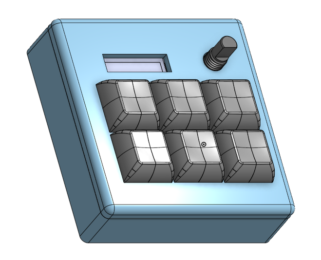
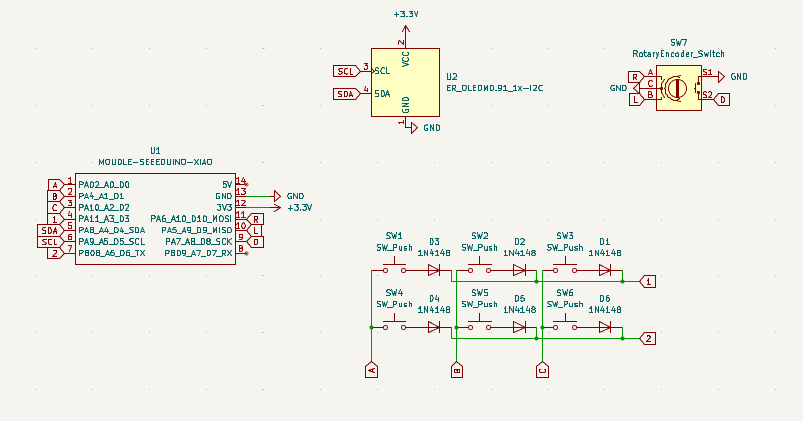
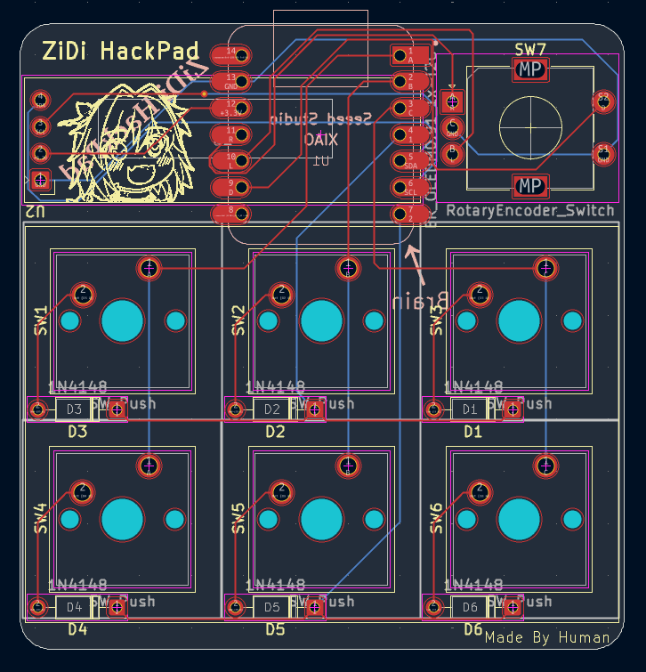

# ZiDi_Hackpad

My Hackpad is a 6-key macropad with an OLED display, rotary encoder, and my own custom firmware.

## Features

* 6 keys in a matrix
* EC11 rotary encoder
* 128x32 OLED display
* Custom firmware

## CAD Model

I am not very experienced with CAD, but I gave it a try.

The case is held together with 4 M3 bolts and heat-set inserts. The PCB is not directly mounted to the case; instead, it is supported by external supports that keep it securely in position.

The case consists of two parts: a bottom and a top. I left a small gap between the parts to make sure they fit together properly.

Made in **Onshape**.

## PCB

The PCB was designed in **KiCad**.

### Schematic

The schematic is quite basic, but it works.

### PCB

## Firmware

I decided to make the firmware a separate project, so you can find it here:

The `production` folder contains `firmware.uf2`, which is a compiled version of the CircuitPython firmware packaged as a UF2 file.

> Want to create something similar yourself? Check out this guide: [Create Custom UF2 File for Easy CircuitPython Flashing](https://embeddedcomputing.com/technology/open-source/create-custom-uf2-file-for-easy-circuitpython-flashing)

## BOM

* 6x Cherry MX switches
* 6x DSA keycaps
* 6x 1N4148 DO-35 diodes
* 1x 0.91" 128x32 OLED display
* 1x EC11 rotary encoder
* 1x XIAO RP2040
* 4x M3x16mm screws
* 4x M3x5mm heat-set inserts
* 1x 3D-printed case